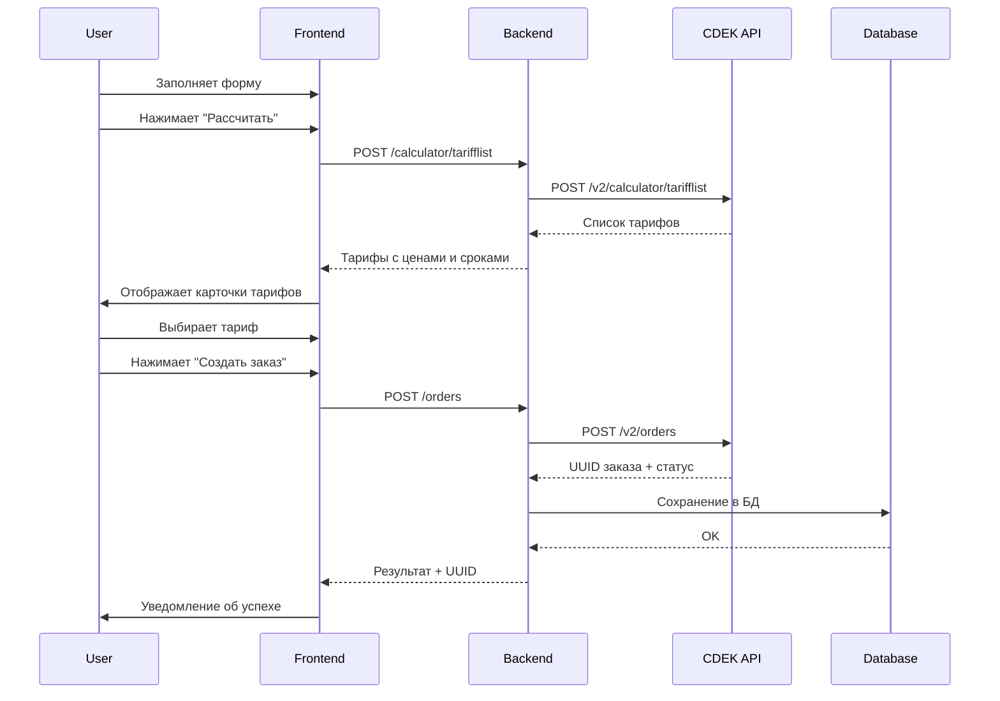

# Интеграция создания заказов CDEK

## 📋 Обзор

Реализован полный цикл создания заказов в CDEK API:
1. Расчёт стоимости и сроков доставки
2. Выбор тарифа из предложенных вариантов
3. Создание заказа с сохранением в базе данных
4. Отслеживание статуса заказа

## 🏗️ Архитектура

### Backend (NestJS)

**Контроллер:** `cdek-api/src/cdek/cdek.controller.ts`
- `POST /cdek/calculator/tarifflist` - расчёт тарифов
- `POST /cdek/orders` - создание заказа
- `GET /cdek/orders?cdek_number=...` - получение информации о заказе

**Сервис:** `cdek-api/src/cdek/cdek.service.ts`
- `calculateTariffList()` - расчёт стоимости
- `registerOrder()` - создание заказа + сохранение в БД
- `getOrderInfo()` - получение статуса заказа

**DTO:** `cdek-api/src/cdek/dto/create-cdek-order.dto.ts`
- Полная валидация структуры заказа
- Поддержка всех полей CDEK API
- Автоматическая трансформация типов

### Frontend (Vue 3)

**Компонент:** `frontend/src/views/CreateOrderView.vue`
- Форма с автокомплитом городов
- Интеграция с DaData для адресов и ФИО
- Расчёт тарифов с отображением карточек
- Создание заказа с валидацией

**Сервис:** `frontend/src/services/cdek.service.ts`
- `calculateTariff()` - расчёт тарифов
- `createOrder()` - отправка заказа

### База данных (PostgreSQL)

**Схема:** `cdek-api/prisma/schema.prisma`

Основные таблицы:
- `CdekOrder` - шапка заказа
- `CdekOrderPackage` - посылки/упаковки
- `CdekOrderItem` - товары в посылках
- `CdekOrderRequest` - журнал обработки запросов
- `CdekOrderRelated` - связанные сущности (возвраты и т.д.)

## 🚀 Использование

### 1. Расчёт стоимости

**Frontend:**
```typescript
const tariffs = await cdekService.calculateTariff({
  date: "2025-10-22T12:00:00+07:00",
  type: 1,
  from_location: {
    code: 270,
    postal_code: "630000"
  },
  to_location: {
    code: 44,
    postal_code: "101000"
  },
  packages: [
    { weight: 1000, length: 30, width: 20, height: 10 }
  ]
})
```

**Backend API:**
```bash
curl -X POST http://localhost:3000/cdek/calculator/tarifflist \
  -H "Content-Type: application/json" \
  -d '{ ... }'
```

### 2. Создание заказа

**Frontend:**
```typescript
const result = await cdekService.createOrder({
  type: 1,
  tariff_code: 136,
  recipient: {
    name: "Иванов Иван",
    phones: [{ number: "+79991234567" }]
  },
  from_location: { ... },
  to_location: { ... },
  packages: [ ... ]
})
```

**Backend API:**
```bash
curl -X POST http://localhost:3000/cdek/orders \
  -H "Content-Type: application/json" \
  -d '{ ... }'
```

## 📝 Важные особенности

### Обязательные поля

1. **tariff_code** - должен быть получен из расчёта
2. **recipient** - имя и телефон получателя
3. **from_location** и **to_location** - коды городов и индексы
4. **packages** - хотя бы одна посылка с габаритами
5. **packages[].comment** - ОБЯЗАТЕЛЬНО непустое значение (минимум "-")

### Валидация

**Фронтенд:**
- Проверка заполнения всех обязательных полей
- Валидация формата телефона
- Проверка формата почтового индекса (6 цифр)
- Проверка выбора тарифа

**Бэкенд:**
- `class-validator` для DTO
- Очистка пустых значений
- Преобразование типов (string → number)
- Добавление комментария "-" к посылкам если пусто

### Обработка ошибок

Детальные сообщения об ошибках:
- Валидация CDEK API
- Проблемы с тарифами
- Ошибки сохранения в БД
- Логирование всех запросов

## 🔄 Процесс работы



## 📊 Структура ответа от CDEK

```json
{
  "entity": {
    "uuid": "12345678-1234-1234-1234-123456789012"
  },
  "requests": [
    {
      "request_uuid": "...",
      "type": "CREATE",
      "state": "SUCCESSFUL",
      "date_time": "2025-10-21T12:00:00+03:00"
    }
  ],
  "related_entities": [
    {
      "type": "direct",
      "uuid": "...",
      "cdek_number": "1234567890"
    }
  ]
}
```

## 🔍 Отладка

### Логи Backend

```bash
cd cdek-api
yarn start:dev
# или
npm run start:dev
```

Логи выводятся в консоль и сохраняются в таблицу `api_logs`.

### Логи Frontend

Откройте DevTools (F12) → Console:
- `📦 Отправка заказа в CDEK:` - тело запроса
- `✅ Результат создания заказа:` - ответ сервера
- `❌ Ошибка при создании заказа:` - детали ошибки

### Просмотр в БД

```sql
-- Последние заказы
SELECT id, uuid, "cdekNumber", "tariffCode", "createdAt" 
FROM "CdekOrder" 
ORDER BY "createdAt" DESC 
LIMIT 10;

-- Детали заказа
SELECT o.*, 
       json_agg(p.*) as packages
FROM "CdekOrder" o
LEFT JOIN "CdekOrderPackage" p ON p."orderId" = o.id
WHERE o.id = 1
GROUP BY o.id;
```

## 🧪 Тестирование

### Автоматический тест
```bash
./test-order-creation.sh
```

### Ручное тестирование
Смотрите `TESTING_ORDER_CREATION.md`

## 📚 Документация

- `ORDER_CREATION_GUIDE.md` - подробное руководство по созданию заказов
- `TESTING_ORDER_CREATION.md` - инструкции по тестированию
- `CDEK_API_FRONTEND_GUIDE.md` - общая документация по CDEK API
- [Официальная документация CDEK](https://apidoc.cdek.ru/)

## ⚠️ Известные ограничения

1. **Тестовое окружение** - используется тестовый API CDEK
2. **Комментарий к посылке** - обязательно должен быть непустым
3. **Номер заказа** - генерируется автоматически на фронтенде
4. **Авторизация** - используется OAuth2 с автоматическим обновлением токена

## 🎯 Следующие шаги

- [ ] Добавить выбор способа доставки (до двери / до ПВЗ)
- [ ] Реализовать печать накладных и штрихкодов
- [ ] Добавить отслеживание статуса заказа
- [ ] Реализовать создание возвратных заказов
- [ ] Добавить поддержку дополнительных услуг (страховка, SMS и т.д.)
- [ ] Реализовать массовое создание заказов из Excel/CSV
- [ ] Добавить интеграцию с другими службами доставки

## 👥 Контакты

Для вопросов и предложений создавайте issue в репозитории.
